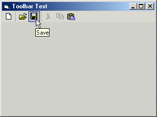



## Office XP\-style Toolbar

### Description

A custom control that allows you to use an Office XP-style toolbar with your applications. Combine with the vbAccelerator Icon Menu Control (www.vbaccelerator.com) and you can make your apps look almost completely like Office XP!
 
### More Info
 
All explanations are included in the Readme file.

             |
---                |---
**Submitted On**   |2001-09-30 15:46:22
**By**             |[Telperion](https://github.com/Planet-Source-Code/PSCIndex/blob/master/ByAuthor/telperion.md)
**Level**          |Intermediate
**User Rating**    |4.8 (38 globes from 8 users)
**Compatibility**  |VB 6\.0
**Category**       |[Custom Controls/ Forms/  Menus](https://github.com/Planet-Source-Code/PSCIndex/blob/master/ByCategory/custom-controls-forms-menus__1-4.md)
**World**          |[Visual Basic](https://github.com/Planet-Source-Code/PSCIndex/blob/master/ByWorld/visual-basic.md)
**Archive File**   |[Office XP\-272429302001\.zip](https://github.com/Planet-Source-Code/telperion-office-xp-style-toolbar__1-27674/archive/master.zip)

